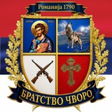

<div align="right">

[Српски](README.md) · **English**

</div>

<div align="center">
  

# Čvoro Brotherhood

**Romanija · 1790**

Website of the Čvoro family brotherhood from Romanija — the coat of arms, history, family tree, gallery and news in one place.

</div>

---

## About the project

In 1790 three brothers came to Romanija and started the line that grew into one of the largest families in the Sarajevo–Romanija region. This site exists so that memory doesn't stay locked in houses and notebooks, but is available to anyone carrying the name or looking for their roots.

It's built as a **single page** you move through, from the coat of arms to today's news. Plain HTML, CSS and JavaScript — no database, no server, no display libraries. Which means it will still work in twenty years, and hosting costs nothing.

The key decision: **content changes without touching code.** News is written in a Google Sheet, photos are dropped into a folder. Whoever takes over doesn't need to know a single line of HTML.

## What's on the site

| Section | Content |
|---|---|
| **Emblems** | The meaning of each part of the coat of arms — St. Luke as the patron saint, Romanija with the wolf, crossed rifles, the cross, the oak wreath, the ribbon with the year |
| **History** | The origins of the brotherhood and a timeline across generations |
| **Gallery** | Photographs from gatherings, with a lightbox view |
| **Family tree** | An embedded tree from the FamilyEcho platform |
| **News** | Announcements pulled live from a Google Sheet |
| **Support** | Donation account with an IBAN copy button and a Viber contact |

## Built with

`HTML5` · `CSS3` · `JavaScript` (no libraries) · `PapaParse` · `Google Sheets` · `FamilyEcho`

The only external dependency is PapaParse, a small library that reads the CSV from the Google Sheet. Everything else — menu, lightbox, copy-to-clipboard, animations — is handwritten, in a little over eighty lines.

## Structure

```
.
├── index.html          # the whole site: all sections, styles and content
├── css/style.css       # styles
├── js/
│   ├── main.js         # menu, lightbox, IBAN copy, animations
│   ├── galerija.js     # photo list
│   └── vijesti.js      # reads news from the Google Sheet
├── assets/             # coat of arms in several sizes, favicon
├── slike/              # gallery photographs
├── build.py            # page generator (from the earlier, multi-page form)
└── *.html              # redirects from old addresses to sections
```

Pages like `istorija.html` and `podrska.html` remain as redirects to the matching section, so links shared earlier still work.

## Colours and typography

The palette comes from the coat of arms itself:

| Colour | Hex | Meaning |
|---|---|---|
| Deep navy | `#0E2148` | shield background, header |
| Gold | `#C6A24C` | ribbons, headings, highlights |
| Crimson | `#8E1B22` | the cross, accents |
| Parchment | `#F4EFE3` | page background |

Type: **Playfair Display** for headings, **Spectral** for body text, **PT Sans** for small labels. All in Cyrillic — for a site like this that isn't a detail but part of the identity.

## Adding content

### A news item

News is written in a **Google Sheet**, which the site reads on every visit. The editor doesn't open code, doesn't log in anywhere, doesn't wait for anyone — they add a row and the news is live.

The sheet must be published via *File → Share → Publish to web → CSV*, and its link lives in `js/vijesti.js`.

### A photograph

1. Drop the file into the `slike/` folder — lowercase, no spaces or diacritics (`slava-2025.jpg`, not `Слава 2025.jpg`).
2. Add a line to `js/galerija.js`:

```js
{ f: "slava-2025.jpg", opis: "Слава Свети Лука 2025." },
```

3. Save and push to GitHub — this can be done through the GitHub website itself, with no software at all.

## Running it

```bash
git clone https://github.com/Cvoki/sajt_bratstva.git
cd sajt_bratstva
```

Open `index.html` in a browser.

For a local server (needed to test the news feed, because of how browsers handle external data):

```bash
python3 -m http.server 8000
# then open http://localhost:8000
```

## Hosting

The site is static, so it runs on any free service — **Netlify**, **Cloudflare Pages** or **GitHub Pages**. Connect the repository and every change publishes itself, usually within a minute.

## License

The code is free to use and learn from. **The coat of arms, photographs, texts and family data belong to the Čvoro Brotherhood** and are not for reuse without the brotherhood's consent.

---

<div align="center">
  <sub>Built by <a href="https://github.com/Cvoki">Luka Cvoro</a> — <a href="mailto:lukac95@gmail.com">lukac95@gmail.com</a></sub>
</div>
